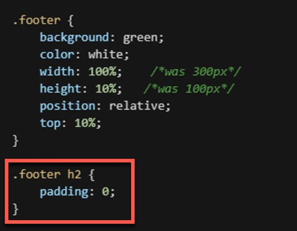
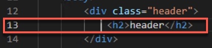
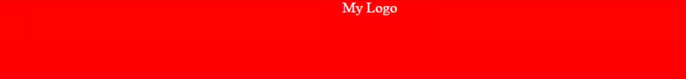
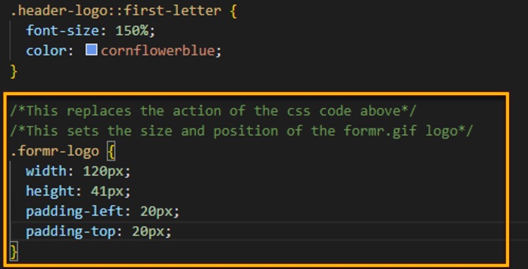
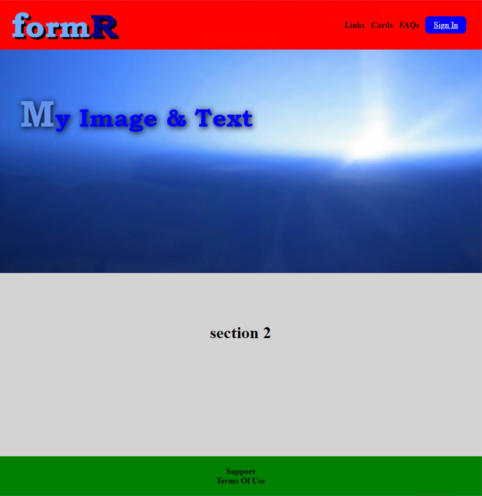

#  HTML Custom App

## Basic Blocks
### 1. Assure VSCode Setup 

- From VSCode

- Be certain that you have checked "Auto Save" in the File menu


- And that you have added "Live Server" to the "Extensions"


___

### 2. Create Files

- In a folder called BasicTraining, create 2 new files.
    - index.<b>html</b>
    - index.<b>css</b>

- Be certain the "favicon.gif" into the root directory.
    This will give you a nice FormR icon on the tab of your browser

___

### 3. Insert Code
#### index.html

Open the index.<b>html</b> and paste the following on Line 1:
<br><br>

```HTML
<!DOCTYPE html>
<html lang="en">
    <head>
       <meta charset="UTF-8">
       <meta http-equiv="X-UA-Compatible" content="ie=edge">
       <link rel="stylesheet" href="index.css">
       <link rel="shortcut icon" href="../favicon.gif">
       <title>Basic-Training</title>
    </head>
    <body>
        <div class="header">
            <h2>header</h2>
        </div>
        <div class="section1">
           <h2>section 1</h2>
        </div>
        <div class="section2">
            <h2>section 2</h2>
        </div>
        <div class="footer">
            <h2>footer</h2>
        </div>
    </body>
</html>
```
**Save this page, if you have NOT checked the "Auto Save" option in the File menu.**

From VSCode, right click on the file "index.<b>html</b>" and click on "Open In Live Server"
- (This option will not be available if you had not added the "Live Server" extension)


___

You will see in your browser the following:


___

#### index.css 
___

Open the index.<b>css</b> file and paste the following on Line 1
<br><br>

```css
/*Basic Blocks*/
@import url('https://fonts.googleapis.com/css?family=Bookman Old Style');

html {
    background: #b3b3b3;
    height: 100%;
    text-align: center;
}

/*The body properites*/
body {
    background: white;
    height: 100%;
}

/*Set global properties for the <h2> tags*/
/*It also overrides the intrinsic margin of*/
/*20 to 0--allowing to stack the blocks together*/
h2 {
    margin: 0;
    font-size: 1.5rem;
    color: white;
    padding: 1.5rem;
    text-align: center;
  }

/*The .header properites*/
.header {
    background: red;
    width: 300px;
    height: 100px;
    position: relative;
}

/*The .section1 properites*/
.section1 {
    background: blue;
    width: 300px;
    height: 100px;
    position: relative;
}

/*The .section2 properites*/
.section2 {
    background: lightgray;
    width: 300px;
    height: 100px;
    position: relative;
}

/*This is another <h2> override*/
/*setting the font color from white to black*/
.section2 h2 {
    color: black;
}

/*The .section2 properites*/
.footer {
    background: green;
    width: 300px;
    height: 100px;
    position: relative;
}

```

### Basic Block Web Page
<br>

**Congratulations**, you have just created a simple html page with a cascading style sheet (CSS) that makes 4 *basic blocks!*

Like this:


___

#### Understanding CSS

To understand a little of this CSS code, lets look at the header css properties.
<br><br>
```css
.header {                       Description
  background: red;     makes the background red

  width: 300px;        makes the block 300 pixels
                          wide

  height: 100px;       makes the block 100 pixels 
                          tall

  position: relative;  places the header box 
                        relative to the html code
                        (DOM) reading from the 
                        top to the bottom
}
```
We will be building from this basic page to create a page with fixed header and footer, links with a button and an image.  From there the next course we will move on to adding JavaScript (JS) to this web page.
___
## Large Blocks
<br>
Next we will add to the code in the index.<b>css</b> file to continue building on our basic web page.

___

### 1. Body

In the .body section ADD...<br>

<b><font color=#A81966>width</font></b>: 100%;    /*this will open up the body to a 100% width*/

...below the existing code for <b><font color=#A81966>height</font></b>, like this:
```css
body {
    background: white;
    height: 100%;
    width: 100%;  /*this will open up the body to a 100% width*/
    margin: 0;
}
```
___

### 2. Header
<br>
In the .header section CHANGE <b><font color=#A81966>width</font></b> to 100%
<br> and <b><font color=#A81966>height</font></b> to 10%:
<br><br>

```css
    width: 100%;    /*was 300px*/
    height: 10%;   /*was 100px*/
```
...like this:
```css
.header {
    background: red;
    color: white;
    width: 100%;    /*was 300px*/
    height: 10%;   /*was 100px*/
    position: relative;
}
```
___

### 3. Sections 1 & 2

In section1 <b>AND<b> section2, change the <b><font color=#A81966>width</font></b> to 100% 
<br>AND <b><font color=#A81966>height</font></b> to 40%:
<br><br>
```css
    height: 40%;   /*was 100px*/
    width:  100%;    /*was 300px*/
```

Like this

```css
/*The .section1 properites*/
.section1 {
    background: blue;
    height: 40%; /*was 100px*/
    width: 100%; /*was 300px*/
    position: relative;
}

/*The .section2 properites*/
.section2 {
    background: lightgray;
    height: 40%; /*was 100px*/
    width: 100%; /*was 300px*/
    position: relative;
}
```
___

### 4. Footer

In the .footer section change the <b><font color=#A81966>width</font></b> to 100% 
<br>AND <b><font color=#A81966>height</font></b> to 10%, like this:
<br><br>

```css
    width:  100%;    /*was 300px*/
    height: 10%;    /*was 100px*/
```
___
### 5. &#60;h2&#62; tag
<br>
The &#60;h2&#62; tags come with built in margins which we must override for the blocks to sit perfectly on top of each other.  
<br><br>Please cut and paste this snippet below the body properties.
<br><br>

```css
h2 {
    margin: 0;
    font-size: 2rem;
    padding: 6rem;
}
```
Like this:


<br><br>
<b>ALSO</b>, we must override the padding for this &#60;h2&#62; tag in the footer with the following, placed at the bottom of the css code:

```css
.footer h2 {
    padding: 0;
}

```
Like this:



### Large Blocks Web Page
__

**Congratulation**, now look at your web page.  All the blocks now have changed to fill up the page in Chrome.


___

### Large Blocks Code:
<br>
Below is the full code for the Large Blocks web page.
<br>


#### index.html
___


```html

<!DOCTYPE html>
<html lang="en">
    <head>
        <meta charset="UTF-8">
        <meta http-equiv="X-UA-Compatible" content="ie=edge">
        <link rel="stylesheet" href="index.css">
        <link rel="shortcut icon" href="../favicon.gif">
        <link href="https://fonts.googleapis.com/css?family=Bookman Old Style" rel="stylesheet">
        <title>Basic Training</title>
    </head>
    <body>
        <div class="header">
            <h2>header</h2>
        </div>
        <div class="section1">
            <h2>section 1</h2>
        </div>
        <div class="section2">
            <h2>section 2</h2>
        </div>
        <div class="footer">
            <h2>footer</h2>
        </div>
    </body>
</html>

```
___

#### index.css
___

```css
/*Large Blocks CSS*/
@import url('https://fonts.googleapis.com/css?family=Bookman Old Style');

/*The html properites*/
html {
    background: #b3b3b3;
    height: 100%;
    text-align: center;
}

/*The body properites*/
body {
    background: white;
    height: 100%;
    width: 100%;
    margin: 0;
}

/*Set global properties for the <h2> tags*/
/*It also overrides the intrinsic margin of*/
/*20 to 0--allowing to stack the blocks together*/
h2 {
    margin: 0;
    font-size: 2rem;
    color: white;
    padding: 6rem;
    text-align: center;
}

/*The .header properites*/
.header {
    background: red;
    color: white;
    height: 10%; /*was 100px*/
    width: 100%; /*was 300px*/
    position: relative;
}

/*This is the first <h2> override*/
/*setting the padding from 6 to 1 rem*/
.header h2 {
    padding: 1rem;
}

/*The .section1 properites*/
.section1 {
    background: blue;
    height: 40%; /*was 100px*/
    width: 100%; /*was 300px*/
    position: relative;
}

/*The .section2 properites*/
.section2 {
    background: lightgray;
    height: 40%; /*was 100px*/
    width: 100%; /*was 300px*/
    position: relative;
}

/*This is another <h2> override*/
/*setting the font color from white to black*/
.section2 h2 {
    color:black;
}

/*The .footer properites*/
.footer {
    background: green;
    height: 10%; /*was 100px*/
    width: 100%; /*was 300px*/
    position: relative;
}

/*This is another <h2> override*/
/*setting the padding from 6 to 2 rem*/
.footer h2 {
    padding: 2rem;
}
```
___

## Blocks w/ Fixed Header
### 1. index.<b>html</b>
<br>
Let's ADD and CHANGE code in both index.<b>html</b> AND index.<b>css</b>
<br><br> 
___

#### &#60;header&#62; tag

First the &#60;header&#62; tag

Next we will add to the code to the index.<b>html</b> file to continue building on our basic web page to include a FIXED header.

In the index.html file, replace:

```html
    <h2>header</h2>
```


with:

```html
    <span class="header-logo">My Logo</span>
```    


this should be on line 13 in your VSCode (index.<b>html</b>).

### 2. index.<b>css</b>

Next let's work on the index.<b>css</b> file.  We will make additions to the .header properties and create some new properties.

#### .header

In the .header properties change the <b><font color=#A81966>position:</font></b> from relative to fixed AND add <b><font color=#A81966>z-index:</font></b> 100;
like this:
```css
    position: fixed;   /*was relative*/
    z-index: 100;
```


Now when you scroll up and down the header is fixed; with "My Logo" centered at the top.



To make this look good, we have more work to do in the index.<b>css</b> file.

Below the z-index: 100; add these lines of code:

```css
    display: flex;
    justify-content: space-between;
```
The full .header class should now look like this:
```css
.header {
    background: red;
    color: white;
    font-size: 1.5rem;
    width: 100%;
    height: 10%;
    position: fixed;
    z-index: 100;
	display: flex;
    justify-content: space-between;
}
```
___

#### .header-logo AND .header-logo::first-letter


To get the logo to look good, add this code below the .header properties:
```css
    .header-logo {
      font-family: "Bookman Old Style", sans-serif;
      font-size: 1.7rem;
      font-weight: bolder;
      color: blue;
      text-shadow: 2px 2px 12px #000000;
      padding-left: 20px;
    }

    .header-logo::first-letter {
        font-size: 150%;
        color: cornflowerblue;
    }
```
You have a logo that is font-based.  Later we will change to an image.


___

#### <b><font color=#A81966>top:</font> properties

To make all the blocks have their respective height and place on the page add <b><font color=#A81966>top:</font></b> 10%;
```css
    top: 10%; /*Needed for Fixed Header*/
```
at the bottom of .section1 and .section2 and .footer--it should look like this for those three areas:
```css
    .section1 {
        background: blue;
        color: white;
        font-size: 1.5rem;
        width: 100%;    /*was 300px*/
        height: 40%;  /*was 100px*/
        position: relative;
        top: 10%   /*Needed for Fixed Header*/
    }

    .section2 {
        background: lightgray;
        color: black;
        font-size: 1.5rem;
        width: 100%;    /*was 300px*/
        height: 40%;  /*was 100px*/
        position: relative;
        top: 10%;   /*Needed for Fixed Header*/
    }

    .footer {
        background: green;
        color: white;
        font-size: 1.5rem;    
        width: 100%;    /*was 300px*/
        height: 10%;   /*was 100px*/
        position: relative;
        top: 10%;   /*Needed for Fixed Header*/
    }
```
___
### 3. Nav Bar
#### index.<b>html</b>

Next we will add some links and a button (a nav bar) to the header.

In index.<b>html</b> add the following code, just below<br>
&nbsp;&nbsp;&nbsp;&nbsp;&#60;span class="header-logo"&#62;My Logo&#60;/span&#62; 

```css
<ul class="nav-list">
    <li class="nav-list-item"><a href=#>Links</a>&nbsp;&nbsp;&nbsp;</li>
    <li class="nav-list-item"><a href=#>Cards</a>&nbsp;&nbsp;&nbsp;</li>
    <li class="nav-list-item"><a href=#>FAQs</a>&nbsp;&nbsp;&nbsp;</li>
    <li class="nav-list-item-cta"><a href=#>Sign In</a></li>
</ul>
```
This should start on line 14 in your VSCode in index.<b>html</b> file.


On your browser, you will see some links appear at the top right of the header, like this:


___

#### index.<b>css</b>
Back to index.<b>css</b> we will add this code below the 
<br>
&nbsp;&nbsp;&nbsp;&nbsp;.header-logo::first-letter property:
<br><br>

```css
/*Sets properties for the nav-bar*/
/*Introducing the flex property*/
.nav-list {
    list-style: none;
    margin-right: 30px;
    padding: 0;
    display: flex;
    flex-direction: row;
    align-items: center;
  }
  ```
Like this:


  This will change the "nav bar" from vertical to horizontal in the header and a place a 30px margin on the right side.  It should look like this in Chrome:

  

  ___

  Now let's clean it up with a little more code in index.<b>css</b>.  Just below the above code add this:

```css
  .nav-list-item a {
    color: black;
    font-weight: bold;
    text-decoration: none;
    margin: 8px 0;

  }
```

Notice the change on your browser:

  

___

Now lets make the first 3 links change color when you hover over one, adding this code below the last bit of code:

```css
.nav-list-item a:hover,
.nav-list-item a:active {
  color: #ccc;
}  
```
See the change:

  

___

One final touch is to turn the last link into a blue button. Add this code:

```css
.nav-list-item-cta a {
  color: white;
  background: blue ;
  padding: 0.5rem 1rem;
  border-radius: 8px;
}
```
  

___

### <b>FULL</b> Fixed Header Code
#### index.html

Let's look at all the code in index.<b>html</b> to this point.  You can copy and paste this in your index.<b>html</b> file.

```html
<!DOCTYPE html>
<html lang="en">
    <head>
        <meta charset="UTF-8">
        <meta http-equiv="X-UA-Compatible" content="ie=edge">
        <link rel="stylesheet" href="index.css">
        <link rel="shortcut icon" href="../favicon.gif">
        <link href="https://fonts.googleapis.com/css?family=Bookman Old Style" rel="stylesheet">
        <title>FormR Basic Training</title>
    </head>
    <body>
        <div class="header">
            <span class="header-logo">My Logo</span>
            <ul class="nav-list">
                <li class="nav-list-item"><a href=#>Links</a>&nbsp;&nbsp;&nbsp;</li>
                <li class="nav-list-item"><a href=#>Cards</a>&nbsp;&nbsp;&nbsp;</li>
                <li class="nav-list-item"><a href=#>FAQs</a>&nbsp;&nbsp;&nbsp;</li>
                <li class="nav-list-item-cta"><a href=#>Sign In</a></li>
            </ul>
        </div>
        <div class="section1">
            <h2>section 1</h2>
        </div>
        <div class="section2">
            <h2>section 2</h2>
        </div>
        <div class="footer">
            <h2>footer</h2>
        </div>
    </body>
</html>
```
___
#### index.css
AND the current code for index.<b>css</b>:
___

```css
@import url('https://fonts.googleapis.com/css?family=Bookman Old Style');

/*The html properites*/
html {
    background: #b3b3b3;
    height: 100%;
    text-align: center;
}

/*The body properites*/
body {
    background: white;
    height: 100%;
    width: 100%;
    margin: 0;
}

/*Set global properties for the <h2> tags*/
/*It also overrides the intrinsic margin of*/
/*20 to 0--allowing to stack the blocks together*/
h2 {
    margin: 0;
    font-size: 2rem;
    color: white;
    padding: 6rem;
    text-align: center;
}

/*The .header properites*/
.header {
    background: red;
    width: 100%;    /*was 300px*/
    height: 10%;   /*was 100px*/
    position: fixed;  /*was relative*/
    z-index: 100;
    display: flex;
    justify-content: space-between;
}

/*Sets all the properties for the font-based logo*/
.header-logo {
    font-family: "Bookman Old Style", sans-serif;
    font-size: 30px;
    font-weight: bolder;
    color: blue;
    text-shadow: 2px 2px 12px #000000;
    padding-left: 20px;
}

/*Sets the properties for the first letter*/
/*of the font-based logo*/
.header-logo::first-letter {
    font-size: 150%;
    color: cornflowerblue;
}

/*Sets properties for the nav-bar*/
/*introducing the flex property*/
.nav-list {
    list-style: none;
    margin-right: 30px;
    padding: 0;
    display: flex;
    flex-direction: row;
    align-items: center;
}

/*Sets the properties for each of the nav-bar items*/
.nav-list-item a {
    color: black;
    font-weight: bold;
    text-decoration: none;
    margin: 8px 0;
}

/*Sets the color of the nav-bar items when you hover*/
.nav-list-item a:hover,
.nav-list-item a:active {
    color: #ccc;
}

/*Creates the blue button around the 'Sign In'*/
/*button.  -cta stands for 'Call To Action'*/
.nav-list-item-cta a {
    color: white;
    background: blue ;
    padding: 0.5rem 1rem;
    border-radius: 8px;
}

/*The .section1 properites*/
.section1 {
    background: blue;
    height: 40%;  /*was 100px*/
    width: 100%;    /*was 300px*/
    position: relative;
    top: 10%; /*Added to adjust the top position*/
}

/*The .section2 properites*/
.section2 {
    background: lightgray;
    width: 100%;    /*was 300px*/
    height: 45%;  /*was 100px*/
    position: relative;
    top: 10%; /*Added to adjust the top position*/
}

/*This is another <h2> override*/
/*setting the font color from white to black*/
.section2 h2 {
    color: black;
}

/*The .footer properites*/
.footer {
    background: green;
    width: 100%;    /*was 300px*/
    height: 10%;   /*was 100px*/
    position: relative;
    top: 10%; /*Added to adjust the top position*/
}

/*This is another <h2> override*/
/*setting the padding from 6 to 0 rem*/
.footer h2 {
    padding: 0;
}
```
## Blocks W/ Fixed Footer


```html
<!DOCTYPE html>
<html lang="en">
    <head>
        <meta charset="UTF-8">
        <meta http-equiv="X-UA-Compatible" content="ie=edge">
        <link rel="stylesheet" href="index.css">
        <link rel="shortcut icon" href="../favicon.gif">
        <link href="https://fonts.googleapis.com/css?family=Bookman Old Style" rel="stylesheet">
        <title>Basic Training</title>
    </head>
    <body>
        <div class="header">
            <span class="header-logo">My Logo</span>
            <ul class="nav-list">
                <li class="nav-list-item"><a href=#>Links</a>&nbsp;&nbsp;&nbsp;</li>
                <li class="nav-list-item"><a href=#>Cards</a>&nbsp;&nbsp;&nbsp;</li>
                <li class="nav-list-item"><a href=#>FAQs</a>&nbsp;&nbsp;&nbsp;</li>
                <li class="nav-list-item-cta"><a href=#>Sign In</a></li>
            </ul>
        </div>
        <div class="section1">
            <h2>section 1</h2>
        </div>
        <div class="section2">
            <h2>section 2</h2>
        </div>

        <div class="footer">
            <ul class="footer-list">
                <li class="footer-list-item"><a href=#>Support</a></li>
                <li class="footer-list-item"><a href=#>Terms Of Use</a></li>
            </ul>
        </div>
    </body>
</html>

```


```css
@import url('https://fonts.googleapis.com/css?family=Bookman Old Style');

/*From Basic Blocks*/
html {
    background: #b3b3b3;
    height: 100%;
    padding: 0px;
}

/*The body properites*/
body {
  background: white;
  height: 100%;
  width: 100%;
  margin: 0;
}

/*Set global properties for the <h2> tags*/
/*It also overrides the intrinsic margin of*/
/*20 to 0--allowing to stack the blocks together*/
h2 {
  margin: 0;
  font-size: 2rem;
  color: white;
  padding: 6rem;
  text-align: center;
}

/*The .header properites*/
.header {
  background: red;
  width: 100%;    /*was 300px*/
  height: 10%;   /*was 100px*/
  position: fixed;  /*was relative*/
  z-index: 100;
  display: flex;
  justify-content: space-between;
}

/*Sets all the properties for the font-based logo*/
.header-logo {
  font-family: "Bookman Old Style", sans-serif;
  font-size: 30px;
  font-weight: bolder;
  color: blue;
  text-shadow: 2px 2px 12px #000000;
  padding-left: 20px;
}

/*Sets the properties for the first letter*/
/*of the font-based logo*/
.header-logo::first-letter {
  font-size: 150%;
  color: cornflowerblue;
}

/*Sets properties for the nav-bar*/
/*introducing the flex property*/
.nav-list {
  list-style: none;
  margin-right: 30px;
  padding: 0;
  display: flex;
  flex-direction: row;
  align-items: center;
}

/*Sets the properties for each of the nav-bar items*/
.nav-list-item a {
  color: black;
  font-weight: bold;
  text-decoration: none;
  margin: 8px 0;
}

/*Sets the color of the nav-bar items when you hover*/
.nav-list-item a:hover,
.nav-list-item a:active {
  color: #ccc;
}

/*Creates the blue button around the 'Sign In'*/
/*button.  -cta stands for 'Call To Action'*/
.nav-list-item-cta a {
  color: white;
  background: blue ;
  padding: 0.5rem 1rem;
  border-radius: 8px;
}

/*The .section1 properites*/
.section1 {
  background: blue;
  height: 45%;  /*was 100px*/
  width: 100%;    /*was 300px*/
  position: relative;
  top: 10%; /*Added to adjust the top position*/
}

/*The .section2 properites*/
.section2 {
  background: lightgray;
  width: 100%;    /*was 300px*/
  height: 50%;  /*Added 5% to create scrolling*/
  position: relative;
  top: 10%; /*Added to adjust the top position*/
}

/*This is another <h2> override*/
/*setting the font color from white to black*/
.section2 h2 {
  color: black;
}

/*The .footer properites*/
/*The position was changed to fixed*/
/*With a z-index of 99*/
.footer {
    background: green;
    width: 100%; 
    /*height: 10%;  Removed in place of the bottom property*/
    bottom: 0;
    position: fixed;
    z-index: 99;
}

/*From Basic Fixed Footer with Links*/
.footer-text {
  font-size: x-large;
  text-align: right;
  padding: 0px 30px 0px 65%;}

/*From Basic Fixed Footer with Links*/
.footer-list {
    list-style: none;
    margin: 20px;
    padding: 0;
    display: flex;
    flex-direction: column;
    align-items: center;
  }

/*From Basic Fixed Footer with Links*/
.footer-list-item a {
    color: black;
    font-weight: bold;
    text-decoration: none;
    margin: 8px 0;

  }

/*From Basic Fixed Footer with Links*/
.footer-list-item a:hover,
.footer-list-item a:active {
  color: #ccc;
}

/*This is another <h2> override*/
/*setting the padding from 6 to 0 rem*/
.footer h2 {
  padding: 0;
}


```


## Blocks W/ Image & Overlay


### Final HTML

```html

<!DOCTYPE html>
<html lang="en">
    <head>
        <meta charset="UTF-8">
        <meta http-equiv="X-UA-Compatible" content="ie=edge">
        <link rel="stylesheet" href="index.css">
        <link rel="shortcut icon" href="../favicon.gif">
        <title>Basic Training</title>
    </head>
    <body>
        <div class="header">
            <span class="header-logo">My Logo</span>
            <ul class="nav-list">
                <li class="nav-list-item"><a href=#>Links</a>&nbsp;&nbsp;&nbsp;</li>
                <li class="nav-list-item"><a href=#>Cards</a>&nbsp;&nbsp;&nbsp;</li>
                <li class="nav-list-item"><a href=#>FAQs</a>&nbsp;&nbsp;&nbsp;</li>
                <li class="nav-list-item-cta"><a href=#>Sign In</a></li>
            </ul>
        </div>
        <div class="section1">
            <h2 class="image-text">My Image & Text</h2>
        </div>
        <div class="section2">
            <h2>section 2</h2>
        </div>

        <div class="footer">
            <ul class="footer-list">
                <li class="footer-list-item"><a href=#>Support</a></li>
                <li class="footer-list-item"><a href=#>Terms Of Use</a></li>
            </ul>
        </div>
    </body>
</html>


```
___


### Final CSS

```css

@import url('https://fonts.googleapis.com/css?family=Bookman Old Style');

/*From Basic Blocks*/
html {
    background: #b3b3b3;
    height: 100%;
    padding: 0px;
}

/*The body properites*/
body {
  background: white;
  height: 100%;
  width: 100%;
  margin: 0;
}

/*Set global properties for the <h2> tags*/
/*It also overrides the intrinsic margin of*/
/*20 to 0--allowing to stack the blocks together*/
h2 {
  margin: 0;
  font-size: 2rem;
  color: white;
  padding: 6rem;
  text-align: center;
}

/*The .header properites*/
.header {
  background: red;
  width: 100%;    /*was 300px*/
  height: 10%;   /*was 100px*/
  position: fixed;  /*was relative*/
  z-index: 100;
  display: flex;
  justify-content: space-between;
}

/*Sets all the properties for the font-based logo*/
.header-logo {
  font-family: "Bookman Old Style", sans-serif;
  font-size: 30px;
  font-weight: bolder;
  color: blue;
  text-shadow: 2px 2px 12px #000000;
  padding-left: 20px;
}

/*Sets the properties for the first letter*/
/*of the font-based logo*/
.header-logo::first-letter {
  font-size: 150%;
  color: cornflowerblue;
}

/*Sets properties for the nav-bar*/
/*introducing the flex property*/
.nav-list {
  list-style: none;
  margin-right: 30px;
  padding: 0;
  display: flex;
  flex-direction: row;
  align-items: center;
}

/*Sets the properties for each of the nav-bar items*/
.nav-list-item a {
  color: black;
  font-weight: bold;
  text-decoration: none;
  margin: 8px 0;
}

/*Sets the color of the nav-bar items when you hover*/
.nav-list-item a:hover,
.nav-list-item a:active {
  color: #ccc;
}

/*Creates the blue button around the 'Sign In'*/
/*button.  -cta stands for 'Call To Action'*/
.nav-list-item-cta a {
  color: white;
  background: blue ;
  padding: 0.5rem 1rem;
  border-radius: 8px;
}

/*The .section1 properites*/
/*The main difference is the addition of*/
/*a background image and associated properties*/
.section1 {
  background: url("assets/images/monaco-blue-soft.jpg");
  background-color: blue;
  background-repeat: no-repeat;
  background-size: cover;
  background-position: center;
  top: 10%;
  width: 100%;
  height: 45%;
  position: relative;
  
}

/*Sets all the propterties for the font-based*/
/*text overlay*/
.image-text {
  font-family: "Bookman Old Style", sans-serif;
  font-size: 3rem;
  font-weight: bolder;
  color: blue;
  text-shadow: 2px 2px 12px #000000;
  padding: 80px 400px 20px 0px;
}

/*Sets the properties for the first letter*/
/*of the font-based text overlay*/
.image-text::first-letter {
  font-size: 150%;
  color: cornflowerblue;
}

/*The .section2 properites*/
.section2 {
  background: lightgray;
  width: 100%;    /*was 300px*/
  height: 50%;  /*Added 5% to create scrolling*/
  position: relative;
  top: 10%; /*Added to adjust the top position*/
}

/*This is another <h2> override*/
/*setting the font color from white to black*/
.section2 h2 {
  color: black;
}

/*The .footer properites*/
/*The position was changed to fixed*/
/*With a z-index of 99*/
.footer {
    background: green;
    width: 100%; 
    /*height: 10%;  Removed in place of the bottom property*/
    bottom: 0;
    position: fixed;
    z-index: 99;
}

/*From Basic Fixed Footer with Links*/
.footer-text {
  font-size: x-large;
  text-align: right;
  padding: 0px 30px 0px 65%;}

/*From Basic Fixed Footer with Links*/
.footer-list {
    list-style: none;
    margin: 20px;
    padding: 0;
    display: flex;
    flex-direction: column;
    align-items: center;
  }

/*From Basic Fixed Footer with Links*/
.footer-list-item a {
    color: black;
    font-weight: bold;
    text-decoration: none;
    margin: 8px 0;

  }

/*From Basic Fixed Footer with Links*/
.footer-list-item a:hover,
.footer-list-item a:active {
  color: #ccc;
}

/*This is another <h2> override*/
/*setting the padding from 6 to 0 rem*/
.footer h2 {
  padding: 0;
}

```
___

## BONUS

### Replace logo

In index.<b>html</b> remark out the  &#60;span class="header-logo">My Logo</span&#62; using the 
&#60;!-- --&#62; tags at the beginning and end of this line of code.

Then add  "&#60;img class="formr-logo" src="assets/images/formR.gif"/&#62;" below the &#60;div class="header"&#62; -- like this:


___

Copy/paste the below code:

```html
        <div class="header">
            
            <!--<span class="header-logo">My Logo</span>-->
```
Then add the below css property (.formr-logo) below the .header-logo::first-letter css code...
___

```css
/*This replaces the action of the above css code*/
/*This sets the size and position of the formr.gif logo*/
.formr-logo {
  width: 210px;
  height: 60px;
  padding-left: 20px;
  padding-top: 10px;
}
```
...like this:



___

The final web page should look like this:



___

**CONGRATULATIONS!! YOU HAVE COMPLETED THIS BASIC COURSE ON HTML AND CSS.**

Moving forward we will add JavaScript to include some cool things in the nav-bar, Section2 and responsiveness of the page.

___
