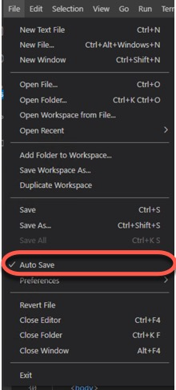
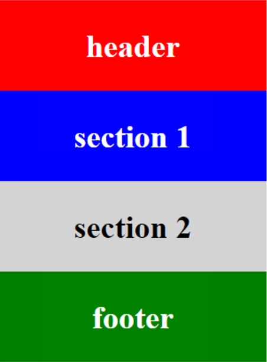
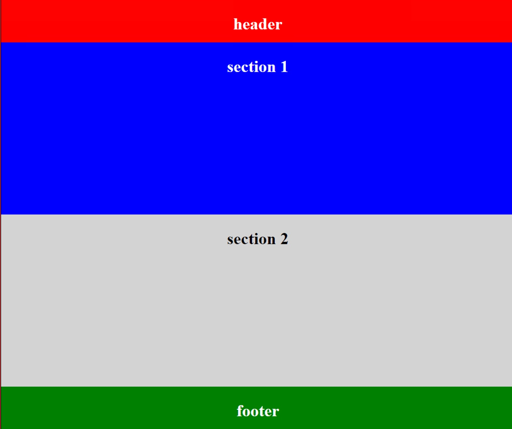
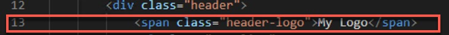

#  HTML Custom App

## Basic Blocks
### Step 1 

- From VSCode

- Be certain that you have checked "Auto Save" in the File menu



- And that you have added "Live Server" to the "Extensions"


- In a folder called BasicTraining, create 2 new files.
    - index.<u>html</u>
    - index.<u>css</u>

- Paste in the "favicon.gif" into the root directory.
    This will give you a nice FormR icon on the tab of your browser

Open the index.<u>html</u> and paste the following on Line 1:
```HTML
<!DOCTYPE html>
<html lang="en">
    <head>
       <meta charset="UTF-8">
       <meta http-equiv="X-UA-Compatible" content="ie=edge">
       <link rel="stylesheet" href="index.css">
       <link rel="shortcut icon" href="../favicon.gif">
       <title>Basic-Training</title>
    </head>
    <body>
        <div class="header">
            <h2>header</h2>
        </div>
        <div class="section1">
           <h2>section 1</h2>
        </div>
        <div class="section2">
            <h2>section 2</h2>
        </div>
        <div class="footer">
            <h2>footer</h2>
        </div>
    </body>
</html>
```
Save this page, if you have NOT checked the "Auto Save" option in the File menu.

From VSCode, right click on the file "index.<u>html</u>" and click on "Open In Live Server"
- (This option will not be available if you had not added the "Live Server" extension)

You will see in your browser the following:s


___
Open the index.<u>css</u> file and paste the following on Line 1

```css
@import url('https://fonts.googleapis.com/css?family=Bookman Old Style');

html {
    background: #b3b3b3;
    height: 100%;
    text-align: center;
}

body {
    background: white;
    height: 100%;
}

.header {
    border: 1px solid red;
    background: red;
    font-size: 1.5rem;
    color: white;
    width: 300px;
    height: 100px;
    position: relative;
}

.section1 {
    border: 1px solid blue;
    background: blue;
    font-size: 1.5rem;
    color: white;
    width: 300px;
    height: 100px;
    position: relative;
}

.section2 {
    border: 1px solid lightgray;
    background: lightgray;
    font-size: 1.5rem;
    color: black;
    width: 300px;
    height: 100px;
    position: relative;
}

.footer {
    border: 1px solid green;
    background: green;
    font-size: 1.5rem;
    color: white;
    width: 300px;
    height: 100px;
    position: relative;
}

```

**Congratulations**, you have just created a simple html page with a cascading style sheet (CSS) that makes 4 *basic blocks!*
Like this:



___ 

To understand this CSS code, lets look at the header css properties.
```css
.header {                       CLASS NAME
    border: 1px solid red;  places a 1 pixel red border around the block
    background: red;        makes the background red
    color: white;           makes the font color white
    font-size: 1.5rem;      rem ensure consistency of font size and spacing           
                            throughout your UI (1.5rem = 24px)
    width: 300px;           makes the block 300 pixels wide
    height: 100px;          makes the block 100 pixels tall
    position: relative;     places the header box relative to the html code
                            (DOM) reading from the top to the bottom
}
```
We will be building from this basic page to create a page with fixed header and footer, links and a button and an image.  From there we will move on to adding JavaScript (JS) to this web page.
___
## Basic Large Blocks

Next we will add to the code in the index.<u>css</u> file to continue building on our basic web page.

### 1. Body

In the .body section add::<br>
```css
width: 100%;    /*this will open up the body to a 100% width*/
``` 

below the existing code for <font color=#A81966>height</font>, like this:
```css
body {
    background: white;
    height: 100%;
    width: 100%;  /*this will open up the body to a 100% width*/
    border:  1px solid black;
    margin: 0;
}
```
___
### 2. Header

In the .header section change width to 100% and height to 10%...
```css
    width: 100%;    /*was 300px*/
    height: 10%;   /*was 100px*/
```
...like this:
```css
.header {
    border: 1px solid red;
    background: red;
    color: white;
    width: 100%;    /*was 300px*/
    height: 10%;   /*was 100px*/
    position: relative;
}
```
___
### 3. Sections 1 & 2

In section1 and section2, change the width to 100% and height to 372px:
```css
    width:  100%;    /*was 300px*/
    height: 40%;   /*was 100px*/
```
___
### 4. Footer

In the .footer section change width to 100% and height to 92px, like this:
```css
    width:  100%;    /*was 300px*/
    height: 10%;    /*was 100px*/
```
___
**Congratulation**, now look at your web page.  All the blocks now have changed to fill up the page in Chrome.



___
## Basic Blocks With Fixed Header
### 1. index.<u>html</u>
___
Header tag

Next we will add to the code to the index.css file to continue building on our basic web page to include a FIXED header.

In the index.html file, replace:

```html
    <h2>header</h2>
```


with:

```html
    <span class="header-logo">My Logo</span>
```    


this should be on line 13 in your VSCode (index.<u>html</u>).

### 2. index.<u>css</u>

Next let's work on the index.<u>css</u> file.  We will make additions to the .header properties and create some new properties.

In the .header properties change the position from relative to fixed and add <u>z-index: 100;</u>
like this:
```css
    position: fixed;   /*was relative*/
    z-index: 100;
```


Now when you scroll up and down the header is fixed; with "My Logo" centered at the top.


To make this look good, we have more work to do in the index.<u>css</u> file.
Below the z-index: 100; add these lines of code:

```css
    display: flex;
    justify-content: space-between;
```
The full .header class should now look like this:
```css
.header {
    border: 1px solid red;
    background: red;
    color: white;
    font-size: 1.5rem;
    width: 100%;
    height: 10%;
    position: fixed;
    z-index: 100;
	display: flex;
    justify-content: space-between;
}
```
___
To get the logo to look good, add this code below the .header properties:
```css
    .header-logo {
      font-family: "Bookman Old Style", sans-serif;
      font-size: 1.7rem;
      font-weight: bolder;
      color: blue;
      text-shadow: 2px 2px 12px #000000;
      padding-left: 20px;
    }

    .header-logo::first-letter {
        font-size: 150%;
        color: cornflowerblue;
    }
```
You have a logo that is font-based.  Later we will change to an image.


___

To make all the blocks have their respective height and place on the page add:
```css
    top: 10%;
```
at the bottom of .section1 and .section2 and .footer--it should look like this for those three areas:
```css
    .section1 {
        border: 1px solid blue;
        background: blue;
        color: white;
        font-size: 1.5rem;
        width: 100%;    /*was 300px*/
        height: 40%;  /*was 100px*/
        position: relative;
        top: 10%   /*Needed for Fixed Header*/
    }

    .section2 {
        border: 1px solid lightgray;
        background: lightgray;
        color: black;
        font-size: 1.5rem;
        width: 100%;    /*was 300px*/
        height: 40%;  /*was 100px*/
        position: relative;
        top: 10%;   /*Needed for Fixed Header*/
    }

    .footer {
        border: 1px solid green;
        background: green;
        color: white;
        font-size: 1.5rem;    
        width: 100%;    /*was 300px*/
        height: 10%;   /*was 100px*/
        position: relative;
        top: 10%;   /*Needed for Fixed Header*/
    }
```
___
### 3. Nav Bar

Next we will add some links and a button (a nav bar) to the header.

In index.<u>html</u> add the following code, just below the 
```css
<span class="header-logo">My Logo</span>:
        <ul class="nav-list">
            <li class="nav-list-item"><a href=#>Links</a>&nbsp;&nbsp;&nbsp;</li>
            <li class="nav-list-item"><a href=#>Cards</a>&nbsp;&nbsp;&nbsp;</li>
            <li class="nav-list-item"><a href=#>FAQs</a>&nbsp;&nbsp;&nbsp;</li>
            <li class="nav-list-item-cta"><a href=#>Sign In</a></li>
        </ul>
```
This should start on line 14 in your VSCode in index.<u>html</u> file.


...to be continued later