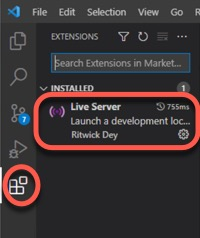

#  HTML Custom App

## Basic Blocks
### Step 1 

- From VSCode

- Be certain that you have checked "Auto Save" in the File menu
And that you have added "Live Server" to the "Extensions"


- In a folder called BasicTraining, create 2 new files.
    - index.html
    - index.css

- Paste in the "favicon.gif" into the root directory.
    Thia will give you a nice FormR icon on the tab of your browser

Open the index.html and paste the following on Line 1:
```HTML
<!DOCTYPE html>
<html lang="en">
    <head>
       <meta charset="UTF-8">
       <meta http-equiv="X-UA-Compatible" content="ie=edge">
       <link rel="stylesheet" href="index.css">
       <link rel="shortcut icon" href="../favicon.gif">
       <title>Basic-Training</title>
    </head>
    <body>
        <div class="header">
            <h2>header</h2>
        </div>
        <div class="section1">
           <h2>section 1</h2>
        </div>
        <div class="section2">
            <h2>section 2</h2>
        </div>
        <div class="footer">
            <h2>footer</h2>
        </div>
    </body>
</html>
```
Save this page, if you have NOT checked the "Auto Save" option in the File menu.

From VSCode, right click on the file "index,html" and click on "Open In Live Server"
- (This option will not be available if you had not added the "Live Server" extension)


You will see in your browser the following:s


___
Open the index.css file and paste the following on Line 1

```css
@import url('https://fonts.googleapis.com/css?family=Bookman Old Style');

html {
    background: #b3b3b3;
    height: 100%;
    text-align: center;
}

body {
    background: white;
    height: 100%;
}

.header {
    border: 1px solid red;
    background: red;
    color: white;
    width: 300px;
    height: 100px;
    position: relative;
}

.section1 {
    border: 1px solid blue;
    background: blue;
    color: white;
    width: 300px;
    height: 100px;
    position: relative;
}

.section2 {
    border: 1px solid lightgray;
    background: lightgray;
    color: black;
    width: 300px;
    height: 100px;
    position: relative;
}

.footer {
    border: 1px solid green;
    background: green;
    color: white;
    width: 300px;
    height: 100px;
    position: relative;
}

```

**Congratulations**, you have just created a simple html page with a cascading style sheet (CSS) that makes 4 basic blocks!
Like this:



___ 

To understand this CSS code, lets look at the header css properties.
```css
.header {                       CLASS NAME
    border: 1px solid red;  places a 1 pixel red border around the block
    background: red;        makes the background red
    color: white;           makes the font color white
    width: 300px;           makes the block 300 pixels wide
    height: 100px;          makes the block 100 pixels tall
    position: relative;     places the header box relative to the html code
                            (DOM) reading from the top to the bottom
}
```
We will be building from this basic page to create a page with fixed header and footer, links and a button and an image,
___
### Step 2

Next we will add to the code in the index.css file to continue building on our basic web page.

BODY

In the .body section add::<br>
```css
width: 100%;    /*this will open up the body to a 100% width*/
``` 

below the existing code for height, like this:
```css
body {
    background: white;
    height: 100%;
    width: 100%;  /*this will open up the body to a 100% width*/
    border:  1px solid black;
    margin: 0;
}
```
___
HEADER

In the .header section change width to 100% and height to 90px... :
```css
    width: 100%;    /*was 300px*/
    height: 92px;   /*was 100px*/
```
...like this:
```css
.header {
    border: 1px solid black;
    background: red;
    color: white;
    width: 100%;    /*was 300px*/
    height: 92px;   /*was 100px*/
    position: relative;
}
```
___
SECTION1 & SECTION2

In section1 and section2, change the width to 100% and height to 380px:
```css
    width:  100%;    /*was 300px*/
    height: 372px;   /*was 100px*/
```
___
FOOTER

In the .footer section change width to 100% and height to 90px, like this:
```css
    width:  100%;    /*was 300px*/
    height: 92px;    /*was 100px*/
```
___
**Congratulation**, now look at your web page.  All the blocks now have changed to fill up the page in Chrome.


___
## Basic With Fixed Header
### Step 1

Next we will add to the code to the index.css file to continue building on our basic web page to include a FIXED header.

First, in the index.html file, replace:
```html
    <h2>header</h2>
```
with:
```html
    <span class="header-logo">My Logo</span>
```    
this should be on line 13 in your VSCode (index.html).

Next let's work on the index.css file.  We will make additions to the .header properties and create some
new properties.

In the .header properties change the position from relative to fixed and add z-index: 100, like this:
```css
    position: fixed;   /*was relative*/
    z-index: 100;
```
Now when you scroll up and down the header is fixed; with "My Logo" centered at the top.

To make this look correct we have more work to do in the index.css file.
Below the z-index and these lines of code:
```css
    display: flex;
    justify-content: space-between;
```
To get the logo to look good, add this code below the .header properties:
```css
    .header-logo {
      font-family: "Bookman Old Style", sans-serif;
      font-size: 30px;
      font-weight: bolder;
      color: blue;
      text-shadow: 2px 2px 12px #000000;
      padding-left: 20px;
    }

    .header-logo::first-letter {
        font-size: 150%;
        color: cornflowerblue;
    }
```
You have a logo that is font-based.  Later we will change to an image.

To make all the blocks have their respective height and place on the page add:
```css
    top: 92px;
```
at the bottom of ,section1 and .section2 and .footer--it should look like this for those three areas:
```css
    .section1 {
        border: 1px solid blue;
        background: blue;
        color: white;
        width: 100%;    /*was 300px*/
        height: 382px;  /*was 100px*/
        position: relative;
        top: 92px
    }

    .section2 {
        border: 1px solid lightgray;
        background: lightgray;
        color: black;
        width: 100%;    /*was 300px*/
        height: 382px;  /*was 100px*/
        position: relative;
        top: 92px;
    }

    .footer {
        border: 1px solid green;
        background: green;
        color: white;
        width: 100%;    /*was 300px*/
        height: 90px;   /*was 100px*/
        position: relative;
        top: 92px;
    }
```
Next we will add some links and button to the header.

In index.html add the following code, just below the 
```css
<span class="header-logo">My Logo</span>:
        <ul class="nav-list">
            <li class="nav-list-item"><a href=#>Links</a>&nbsp;&nbsp;&nbsp;</li>
            <li class="nav-list-item"><a href=#>Cards</a>&nbsp;&nbsp;&nbsp;</li>
            <li class="nav-list-item"><a href=#>FAQs</a>&nbsp;&nbsp;&nbsp;</li>
            <li class="nav-list-item-cta"><a href=#>Sign In</a></li>
        </ul>
```
This should start on line 14 in your VSCode.

...to be continued