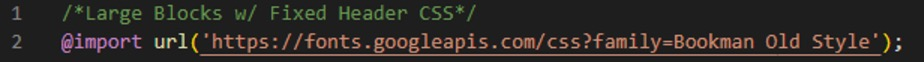
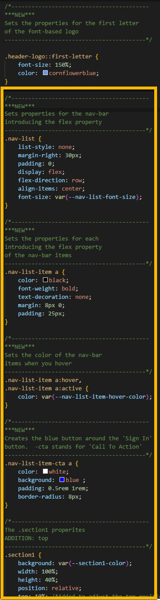

#  HTML Custom App <!-- {docsify-ignore} -->

<!-- -------------------------------------------------------------- >

## 2. Large Blocks  <!-- {docsify-ignore} -->
<br>
Next we will add to the code in the index.<b>css</b> file to continue building on our basic web page.

___

### 1. Body

In the .body section ADD...<br>

<b><font color=#A81966>width</font></b>: 100%;    /*this will open up the body to a 100% width*/

...below the existing code for <b><font color=#A81966>height</font></b>, like this:
```css
body {
    background: white;
    height: 100%;
    width: 100%;  /*this will open up the body to a 100% width*/
    margin: 0;
}
```
___

### 2. Header
<br>
In the .header section CHANGE <b><font color=#A81966>width</font></b> to 100%
<br> and <b><font color=#A81966>height</font></b> to 10%:
<br><br>

```css
    width: 100%;    /*was 300px*/
    height: 10%;   /*was 100px*/
```
...like this:
```css
.header {
    background: red;
    color: white;
    width: 100%;    /*was 300px*/
    height: 10%;   /*was 100px*/
    position: relative;
}
```
___

### 3. Sections 1 & 2

In section1 <b>AND<b> section2, change the <b><font color=#A81966>width</font></b> to 100% 
<br>AND <b><font color=#A81966>height</font></b> to 40%:
<br><br>
```css
    height: 40%;   /*was 100px*/
    width:  100%;    /*was 300px*/
```

Like this

```css
/*The .section1 properites*/
.section1 {
    background: blue;
    height: 40%; /*was 100px*/
    width: 100%; /*was 300px*/
    position: relative;
}

/*The .section2 properites*/
.section2 {
    background: lightgray;
    height: 40%; /*was 100px*/
    width: 100%; /*was 300px*/
    position: relative;
}
```
___

### 4. Footer

In the .footer section change the <b><font color=#A81966>width</font></b> to 100% 
<br>AND <b><font color=#A81966>height</font></b> to 10%, like this:
<br><br>

```css
    width:  100%;    /*was 300px*/
    height: 10%;    /*was 100px*/
```
___
### 5. &#60;h2&#62; tag
<br>
The &#60;h2&#62; tags come with built in margins which we must override for the blocks to sit perfectly on top of each other.  
<br><br>Please cut and paste this snippet below the body properties.
<br><br>

```css
h2 {
    margin: 0;
    font-size: 2rem;
    padding: 6rem;
}
```
Like this:




<br><br>
<b>ALSO</b>, we must override the padding for this &#60;h2&#62; tag in the footer with the following, placed at the bottom of the css code:

```css
.footer h2 {
    padding: 0;
}

```
Like this:



