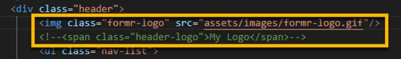
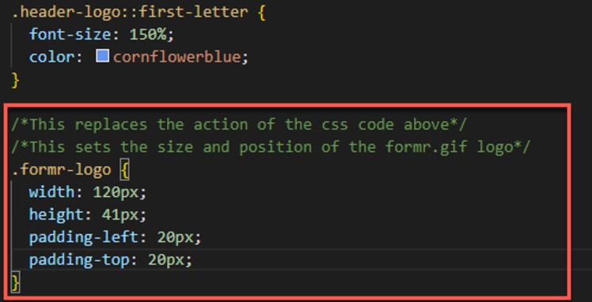

#  HTML Custom App <!-- {docsify-ignore} -->

<!-- -------------------------------------------------------------- >

## 6. BONUS <!-- {docsify-ignore} -->

### Replace logo

In index.<b>html</b> remark out the  &#60;span class="header-logo">My Logo</span&#62; using the 
&#60;!-- --&#62; tags at the beginning and end of this line of code.

Then add  "&#60;img class="formr-logo" src="assets/images/formR.gif"/&#62;" below the &#60;div class="header"&#62; -- like this:



___

Copy/paste the below code:

```html
        <div class="header">
            
            <!--<span class="header-logo">My Logo</span>-->
```
Then add the below css property (.formr-logo) below the .header-logo::first-letter css code...
___

```css
/*This replaces the action of the above css code*/
/*This sets the size and position of the formr.gif logo*/
.formr-logo {
  width: 210px;
  height: 60px;
  padding-left: 20px;
  padding-top: 10px;
}
```
...like this:



___

The final web page should look like this:


___

**CONGRATULATIONS!! YOU HAVE COMPLETED THIS BASIC COURSE ON HTML AND CSS.**

Moving forward we will add JavaScript to include some cool things in the nav-bar, Section2 and responsiveness of the page.

___
