<!-- ------------------------------------------------------------------------- -->

<div class="page-back">

[BACK - Clone FRApps](/Setup/fr0103_Clone-FR-Apps.md)
</div><div class="page-next">

[Vultr Ubuntu - NEXT](/Setup/fr0301_Setup-Vultr-Ubuntu.md)
</div><div style="margin-top:35px">&nbsp;</div> 
 
<!-- ------------------------------------------------------------------------- -->

## 1.5 Custom FRApps React 0:45 <!-- {docsify-ignore-all} -->
- [Purpose and Background](../Setup/purposes/pfr0104_Custom-FR-Apps-HTML.md)
- [Enter Comments in Discord](https://discord.com/channels/928752444316483585/931216956827250709)

#### Introduction  
- Blah

- More Blah


#### Important note about names, capitalization, pictures and code copying
- In this tutorial please be careful to use the Exact Spelling and Capitalization. You will be using Windows, Unix and GitBash command prompts. Improper captialization will cause commands to fail. Some examples are: Local_Admin, myProject, repos, remotes and .ssh.
- This documentation was produced in 2021-2022. You will experience differences in some of the pictures due to the changes made over time by the developers of the softwares and web sites that are used.
- We recommend that you cut and paste code snippets from the Documentation into your workstation/server. This will reduce the errors caused by hand typing.


----


### 1. Copy 5c-my-react-app to 6c-my-custom-app 0:05
----

1. Right click on the client/5c-my-react-app folder and click Copy


2. Right click on the client/5c-my-react-app folder and click Paste

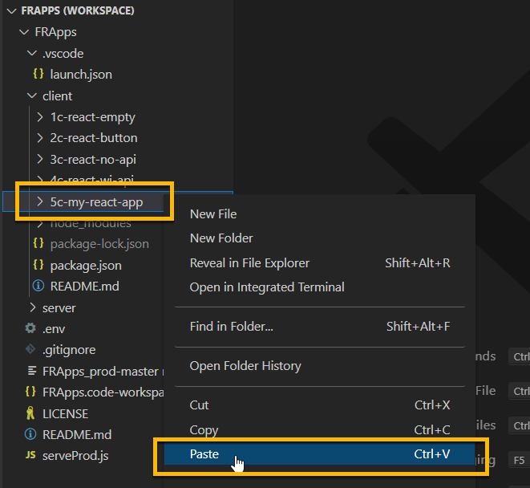


3. Right click on the client/5c-my-react-app-copy folder and click Rename

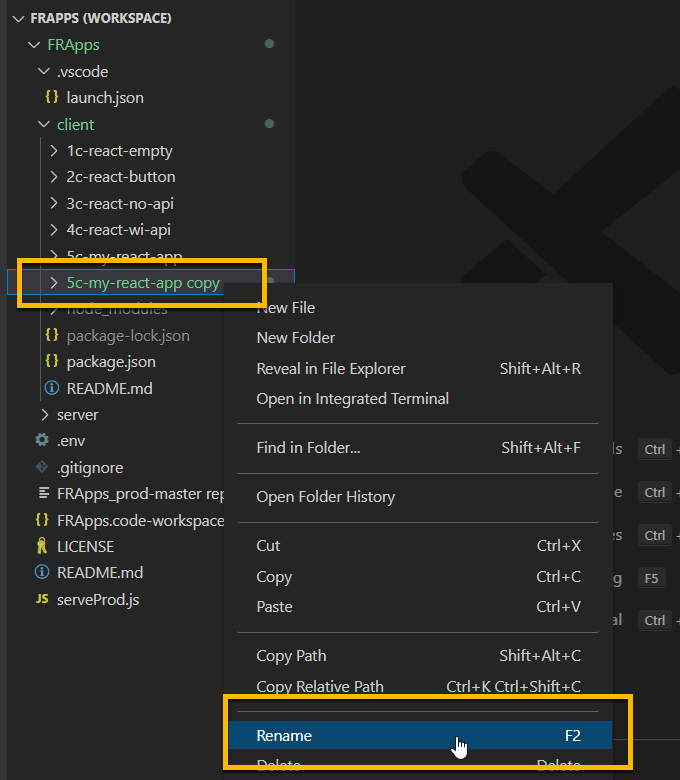

- Enter:

```
6c-my-custom-app
```

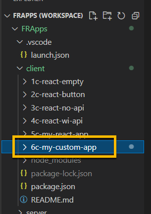

4. From 6c-my-custom-app folder, click to open the .env file

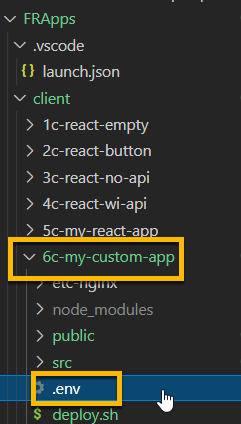

- Change PORT to 50166

```
PORT=50166
```


5. From 6c-my-custom-app folder, click toopen the package.json file

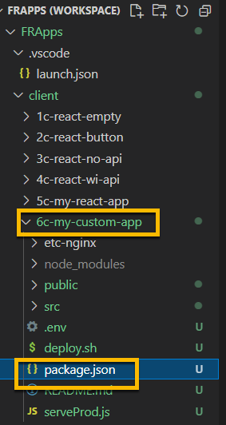

- Make the following 3 changes

```
  "name": "6c-my-custom-app",

  "homepage": "/6c-my-custom-app",

   "prod": "node serveProd.js 51166",
```

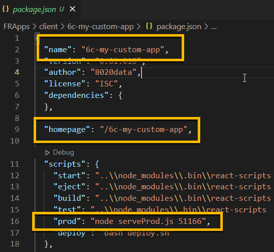

6. From 6c-my-custom-app/public folder, click to open the index.html file

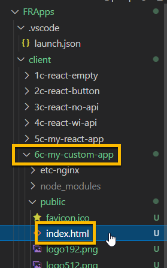

- Change the title

```
    <title>My Custom App</title>
```

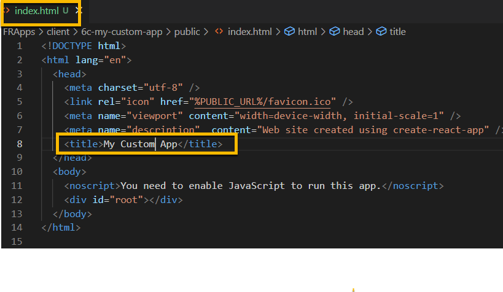


----
### 2. Run Client 6c-my-custom-app application 0:05
----

1. Right click on the client/6c-my-custom-app folder
2. Click Open in Integrated Terminal, then 

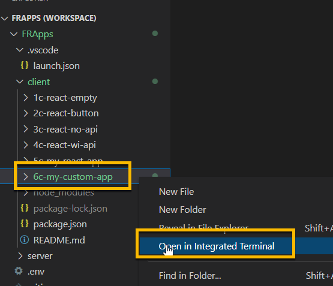 

```
npm start
```

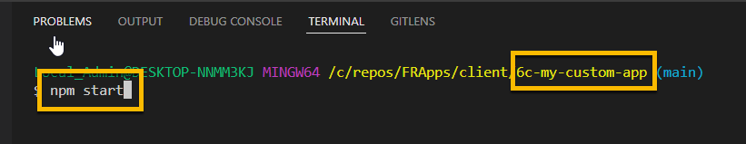

- If you are prompted, click Allow Access

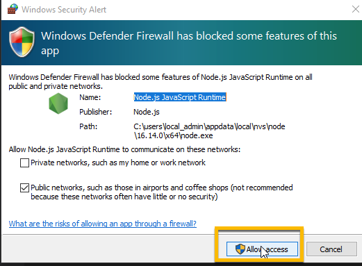

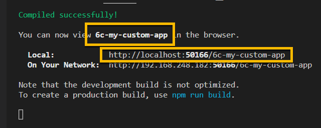

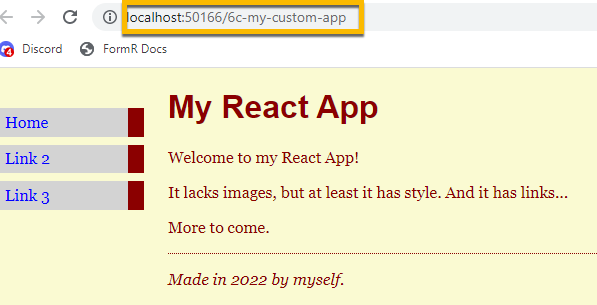

----
### 3. Install and test React-Bootstrap and BootStrap libraries 0:05
----

[React-Bootstrap Reference](https://react-bootstrap.github.io/forms/overview/)

<br/>

1. Right click on the client/ folder
2. Click Open in Integrated Terminal, then 

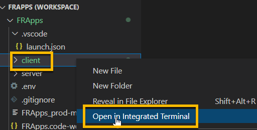


```
npm install react-bootstrap 
```

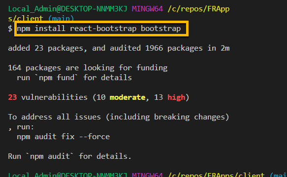

3. In terminal Enter

```
npm install bootstrap
```

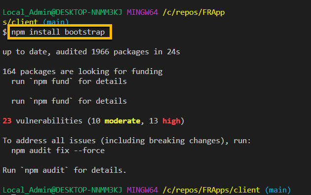

4. Check for production vulnerabilities

```
npm audit --production
```

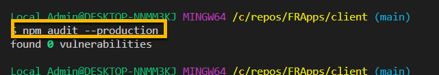

### 5. Add a Primary Button 0:05

<br/>

- Open src/App.js and add the following import statements to App.js

```
import Button from 'react-bootstrap/Button';
import "bootstrap/dist/css/bootstrap.css";
```

- Remove this import statement

```
import "./App.css";
```


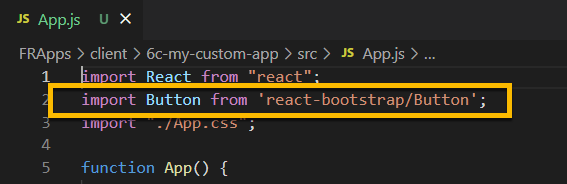

- Add the following code snippet to App.js

```
      <p>
        <Button variant="primary">
          Primary Button
        </Button>
      </p>
```

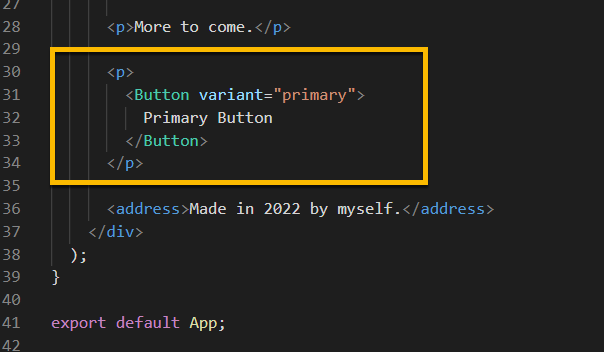


6. Run or refresh http://localhost:50166/6c-my-custom-app on your browser

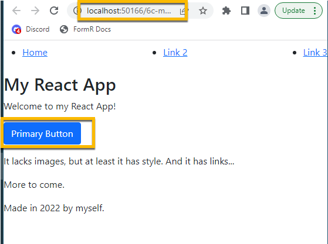


----
### 6. Add Carousel component 0:05
----

[Carousel Sample](https://codesandbox.io/s/carousel-9vhdv2?file=/src/App.js)

<br/>

1. Open src/App.js and add the following import statements to App.js

```
import Carousel from "react-bootstrap/Carousel";
import Image from 'react-bootstrap/Image'
```

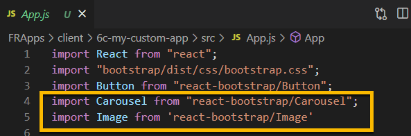

2. Add the following code snippet to App.js

```
      <div>
        <Carousel>
          <Carousel.Item interval={500}>
            <Image
              className="d-block w-100"
              src="https://iso.500px.com/wp-content/uploads/2016/02/stock-photo-114337435.jpg"
              alt="First Slide"
              roundedCircle
            />
            <Carousel.Caption>
              <h3>Label for first slide</h3>
              <p>Sample Text for Image One</p>
            </Carousel.Caption>
          </Carousel.Item>
          <Carousel.Item interval={500}>
            <Image
              className="d-block w-100"
              src="https://iso.500px.com/wp-content/uploads/2016/03/stock-photo-142984111.jpg"
              alt="Second Slide"
            />
            <Carousel.Caption>
              <h3>Label for second slide</h3>
              <p>Sample Text for Image Two</p>
            </Carousel.Caption>
          </Carousel.Item>
        </Carousel>
      </div>
```

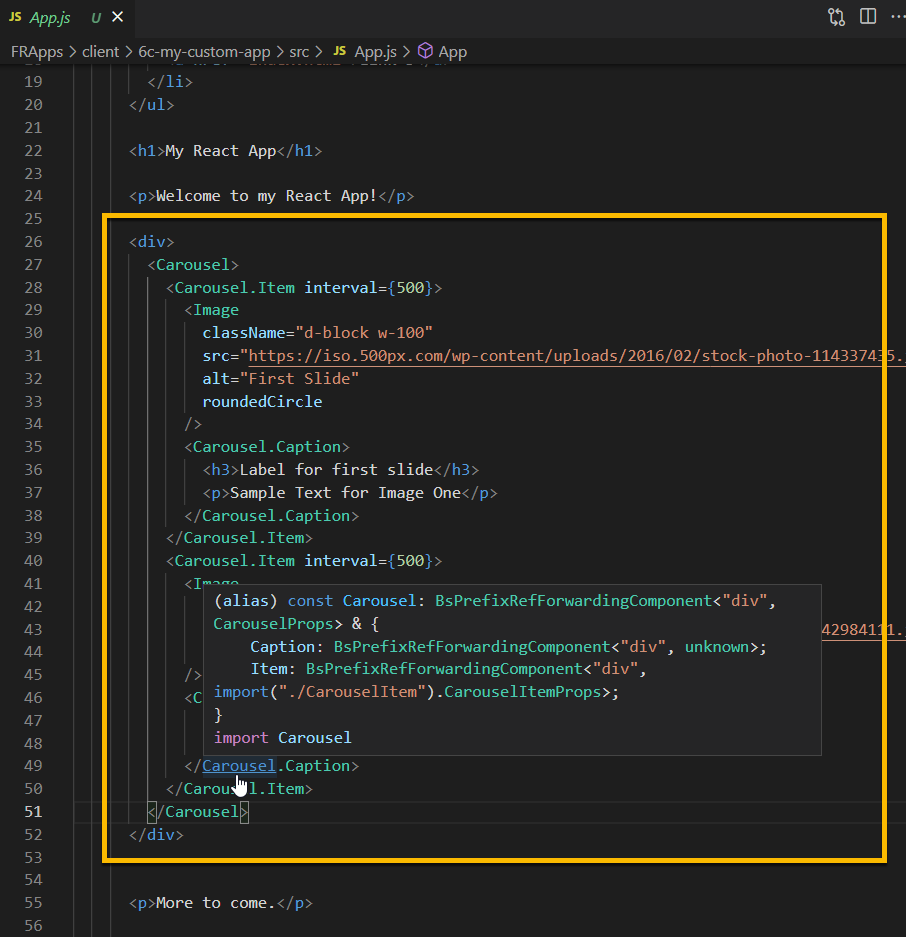


3. Run or refresh http://localhost:50166/6c-my-custom-app on your browser

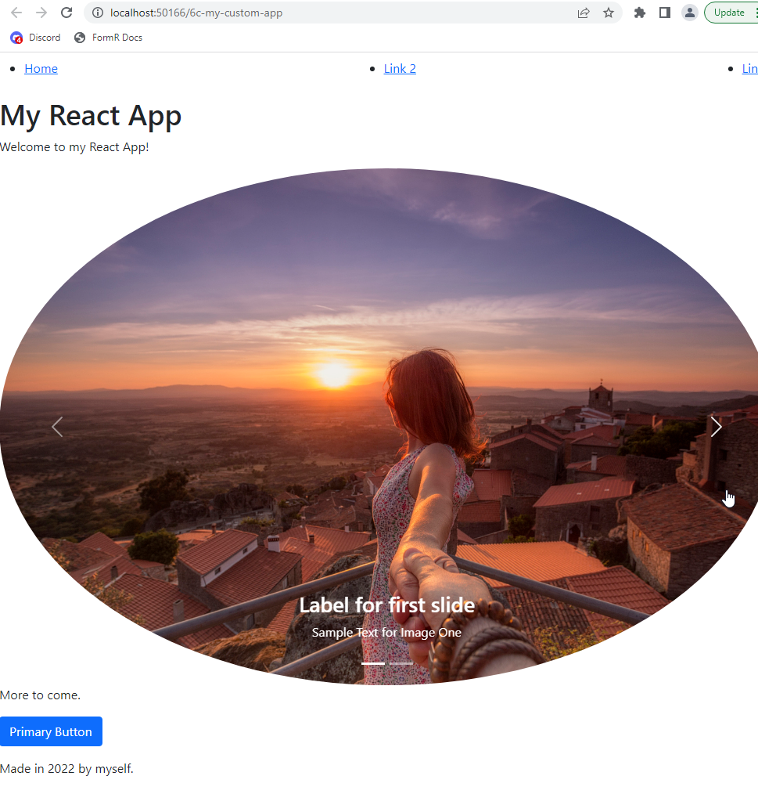


### 7. Add Nav component 0:05
----

[Nav Sample](https://codesandbox.io/s/carousel-9vhdv2?file=/src/App.js)

<br/>

1. Open src/App.js and add the following import statements to App.js

```
import Carousel from "react-bootstrap/Carousel";
import Image from 'react-bootstrap/Image'
```


2. Add the following code snippet to App.js

```
      <div>
        <Carousel>
          <Carousel.Item interval={500}>
            <Image
              className="d-block w-100"
              src="https://iso.500px.com/wp-content/uploads/2016/02/stock-photo-114337435.jpg"
              alt="First Slide"
              roundedCircle
            />
            <Carousel.Caption>
              <h3>Label for first slide</h3>
              <p>Sample Text for Image One</p>
            </Carousel.Caption>
          </Carousel.Item>
          <Carousel.Item interval={500}>
            <Image
              className="d-block w-100"
              src="https://iso.500px.com/wp-content/uploads/2016/03/stock-photo-142984111.jpg"
              alt="Second Slide"
            />
            <Carousel.Caption>
              <h3>Label for second slide</h3>
              <p>Sample Text for Image Two</p>
            </Carousel.Caption>
          </Carousel.Item>
        </Carousel>
      </div>
```


3. Run or refresh http://localhost:50166/6c-my-custom-app on your browser


<!-- ------------------------------------------------------------------------- -->

<div class="page-back">

[BACK - Clone FRApps](/Setup/fr0103_Clone-FR-Apps.md)
</div><div class="page-next">

[Vultr Ubuntu - NEXT](/Setup/fr0301_Setup-Vultr-Ubuntu.md)
</div>


